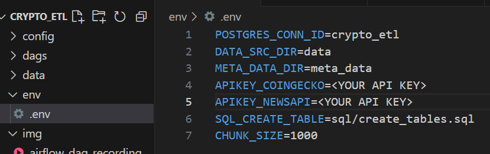
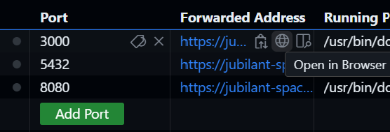

# Crypto_ETL
This is an ETL pipeline to extract OHLC data and info of top 50 crypto coins by market capitalization. Furthermore, news about them are extracted and applied rule-based sentiment analysis. Polarity scores obtained are later aggregated on monthly basic. Transformed data are then loaded into data warehouse.

## Table of Contents
- [Project Structure](#project-structure)
- [Project Setup](#project-setup)
- [Airflow DAG](#airflow-dag)
- [Metabase Dashboard](#metabase-dashboard)

## Project Structure
- This is the high level architecture of this project.
    <br>
    

- I use Python to build all logics in the pipeline, Airflow as orchestration tool and Postgres for data warehouse. Metabase is used for downstream tasks such as Dashboard.

- Extract pipeline extracts candlesticks, news and details about top 50 coins by market capitalization.

- Transform does all necessary data transformation and manipulation. 

- Most importantly, TextBlob library is used on news data to determine polarity scores and these scores are aggregated on coins over every month.

- Finally, Load performs bulk loading csv files to PostgresSQL.

- This is the simple ER Diagram for Data Warehouse built based on Star Schema.
    <br>
    

## Project Setup
1. Create codespace.
    <br>

2. Ensure to put your CoinGecko and NewsAPI API Keys in .env file.
    <br>

3. Build Airflow image by running this command in terminal.
    ```bash
    docker build . --tag extending_airflow:latest
    ```
4. Run docker containers.
    ```bash
    docker-compose up
    ```
5. It will take a few mins to host Airflow, Metbase and Postgres servers. You will see following 3 forwared addresses.
    <br>

## Airflow DAG
- Open link from Port 8080 to run Airflow DAG and enter user name `airflow` and password `airflow`.
- Go to Admin->Connections and set up Postgres connection as follows.
    ```bash
    Connection Id   : crypto_etl
    Connection Type : Postgres
    Host            : postgres
    Database        : crypto_etl_db
    Login           : crypto_etl_user
    Password        : crypto_etl
    Port            : 5432
    ```
- Run `Crypto_ETL` DAG. Demo Video:
    <br>
    <video width="100%" controls>
    <source src="./img/airflow_dag_recording.mp4" type="video/mp4">
    </video>

## Metabase Dashboard
- After running pipeline, Open link from Port 3000 and enter email address:`admin@gmail.com` and password:`zoro123`. `Crypto_ETL` dashboard should be ready to use. Demo Video:
    <br>
    <video width="80%" height="80%" controls>
    <source src="./img/dashboard_recording.mp4" type="video/mp4">
    </video>