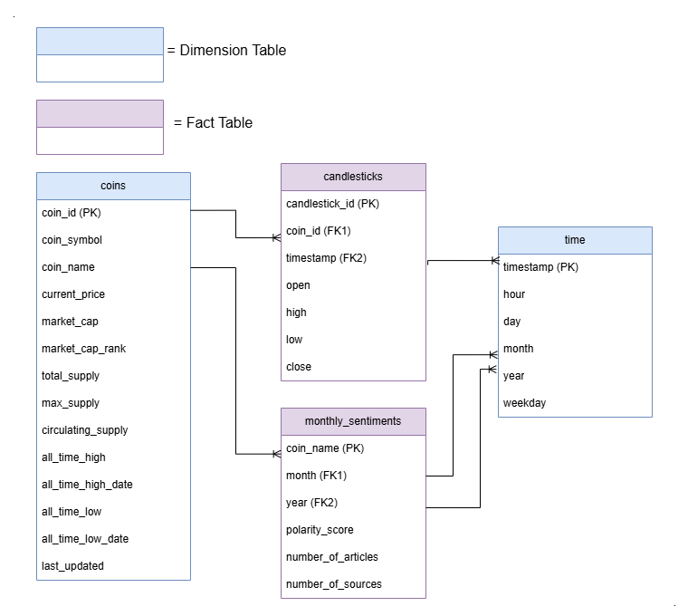

# Crypto_ETL
 

## Table of Contents
- [Project Structure](#project-structure)
- [Project Setup](#project-setup)
- [Airflow DAG](#airflow-dag)
- [Metabase Dashboard](#metabase-dashboard)

## Project Structure
- This is the high level architecture of this project.
    <br>
    

- I use Python to build all logics in the pipeline, Airflow as orchestration tool and Postgres for data warehouse. Metabase is used for downstream tasks such as Dashboard.

- Extract pipeline extracts candlesticks, news and details about top 50 coins by market capitalization.

- Transform does all necessary data transformation and manipulation. 

- Most importantly, rule-based sentiment analysis using TextBlob is applied on news to determine polarity scores and then aggregated these scores on coins over every month.

- Finally, Load performs bulk loading csv files to PostgresSQL.

- This is the simple ER Diagram for Data Warehouse built based on Star Schema.
    <br>
    

- The whole 'coins' table is replaced everytime new data is available because it is easier to maintain this way than updating changed data only. New data are appended to other tables.

## Project Setup
1. Create codespace.
    <br>

1. Build Airflow image by running this command in terminal.
    ```bash
    docker build . --tag extending_airflow:latest
    ```
2. Run docker containers.
    ```bash
    docker-compose up
    ```

## Airflow DAG
- text
    <br>
    

## Metabase Dashboard
- text
    <br>
    <video width="80%" height="80%" controls>
    <source src="./img/dashboard_recording.mp4" type="video/mp4">
    </video>